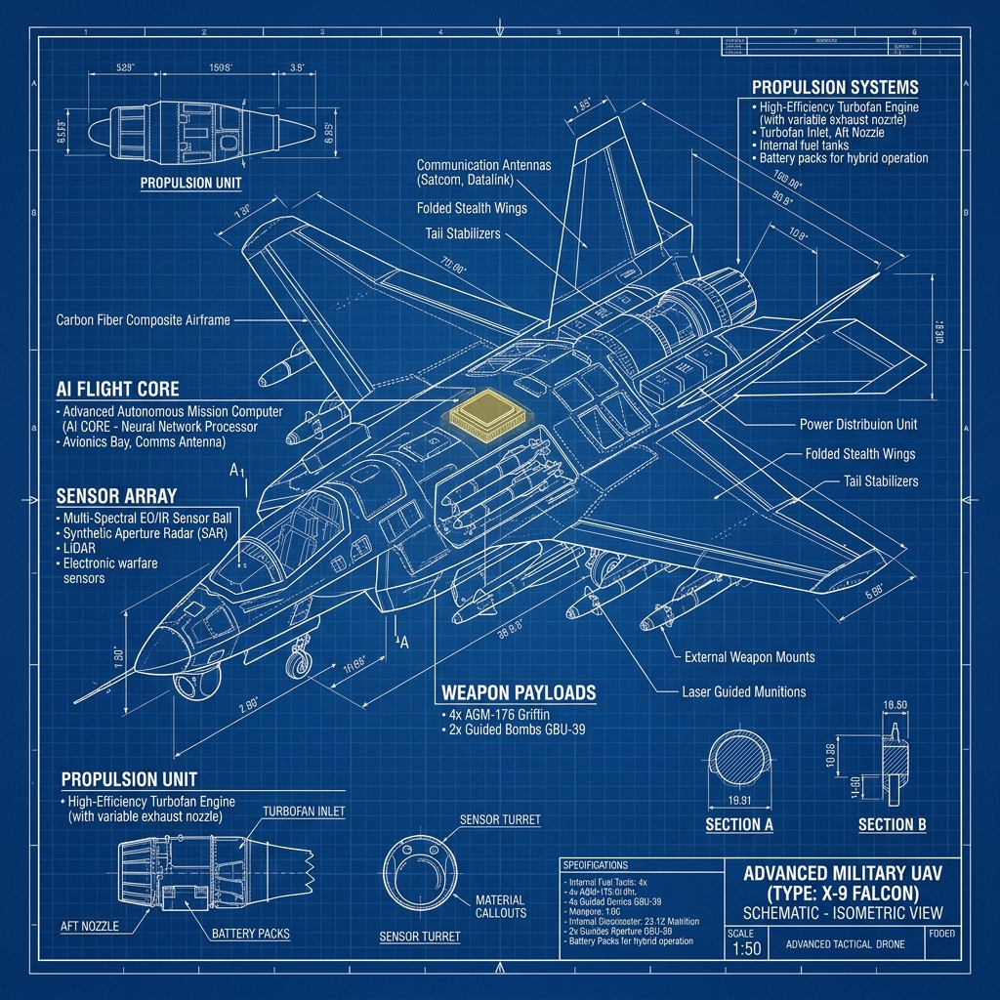

# 🦅 UAV Technical Manual: ARGUS Systems Reference `v3.0-Sovereign`

[](https://github.com/arch-yunus/uav-tech-manual)
[](https://github.com/arch-yunus/uav-tech-manual)
[](https://github.com/arch-yunus/uav-tech-manual)

> **"Göklerin derinliğinde, otonomi ve ruhun muazzam raksı."**
> Bu rehber, ARGUS İHA ekosisteminin donanım spesifikasyonları, bakım protokolleri ve taktik operasyon standartları için nihai kaynaktır.

---

## 🏛️ LCHI Doktrini & Siber-Asabiyet
**ARGUS Platformu**, "Düşük Maliyet - Yüksek Etki" (LCHI) felsefesiyle tasarlanmıştır. Modüler dayanıklılığı önceliklendirerek, en zorlu elektronik harp ortamlarında bile görev icra kabiliyetini korur.

### 📜 Operasyonel Modüller

| Modül | Teknik Odak | Durum |
| :--- | :--- | :--- |
| 🛠️ [Hardware Specs](docs/hardware_specs.md) | İtki, Aviyonik ve Gövde Bütünlüğü | 🟢 Aktif |
| ✈️ [Flight Ops](docs/flight_ops.md) | Uçuş Öncesi ve Sonrası SOP'lar | 🟢 Aktif |
| 📡 [Tactical EW](docs/tactical_ew.md) | Anti-Jamming & Dayanıklı Navigasyon | 🟢 Aktif |
| ⚔️ [Philosophy](docs/philosophy.md) | Makine Ruhu ve Disiplin | 🟢 Aktif |

---

## 🏗️ Sistem Mimarisi (Topoloji)

```mermaid
graph TD
    A[ARGUS Tactical Core] --> B[Aviyonik Birimi]
    A --> C[İtki Modülü]
    A --> D[Elektronik Harp Kalkanı]
    
    subgraph "Senses & Brain"
    B --> B1[GNSS-Resilient IMU Cluster]
    B --> B2[AI Vision Edge Engine]
    end
    
    subgraph "Power & Motion"
    C --> C1[High-Efficiency BLDC Drive]
    C --> C2[Smart BMS (Batarya Yönetimi)]
    end
    
    subgraph "Shield & Link"
    D --> D1[Signal Deception Unit (SDU)]
    D --> D2[Hopping Frequency Link]
    end
```

---

## 🚀 Hızlı Operasyonel Kurulum

1.  **Güç Kontrolü**: Hücre dengesini doğrulayın (min 3.7V/cell).
2.  **IMU Kalibrasyonu**: Birincil IMU kümesinde sıfır ofset sağlayın.
3.  **EH Kalkanı**: OMEGA-tier yanıltma modüllerini **ARGUS Misyon Kontrol** üzerinden aktif edin.
4.  **Senkronizasyon**: Taktik HUD ile gerçek zamanlı telemetri doğrulaması yapın.

---

## 📂 Depo Yapısı

```bash
uav-tech-manual/
├── 📁 docs/               # Teknik Spesifikasyonlar
├── 📁 assets/             # Şemalar & Teknik Görseller
└── 📄 README.md           # Sovereign Giriş Kapısı
```

**Developed with ⚔️ by arch-yunus.**
