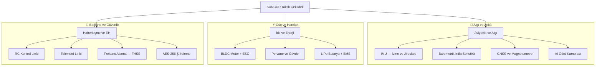

<div align="center">


# 📚 SUNGUR İHA Teknisyenliği: Teknik Eğitim ve Referans Kılavuzu

[](https://github.com/arch-yunus/uav-tech-manual)
[](https://github.com/arch-yunus/uav-tech-manual)
[](https://github.com/arch-yunus/uav-tech-manual)
[](https://github.com/arch-yunus/uav-tech-manual)

> **"İyi bir teknisyen arızayı tamir eder. Mükemmel bir teknisyen arızanın neden oluştuğunu anlar."**

</div>

---

## 🎯 Bu Repo Kimin İçin?

**SUNGUR Teknik Kılavuzu**, İnsansız Hava Araçları (İHA) dünyasına girmek isteyen, sahada çalışan veya kendini geliştirmek isteyen herkes için hazırlanmış, Türkçe dilinde kapsamlı bir **eğitim ve referans deposudur**.

| Hedef Kitle | Bu Repodan Neler Öğreneceksiniz? |
| :--- | :--- |
| 🔰 **Yeni Başlayanlar** | İHA'nın anatomisi, temel bileşenler ve ilk uçuş hazırlığı |
| 🔧 **Saha Teknisyenleri** | Periyodik bakım, arıza tespiti ve saha onarım teknikleri |
| 📡 **Elektronik Meraklıları** | Aviyonik sistemler, haberleşme protokolleri ve EH temelleri |
| 🎓 **Mühendislik Öğrencileri** | Sistem mimarisi, GNC teorisi ve Edge-AI entegrasyonu |

---

## 🗺️ Öğrenme Yolu (Learning Path)

Eğitim içerikleri, sıfırdan uzmana uzanan kademeli bir yapıda düzenlenmiştir:

```
[🔰 Başlangıç] → [🔧 Teknik] → [📡 İleri Seviye] → [🧠 Uzman]
```

### 📚 Modül Dizini

| # | Modül | Kapsam | Seviye |
| :--- | :--- | :--- | :--- |
| 1 | 🛠️ [Donanım ve Bileşenler](docs/hardware_specs.md) | Gövde, motor, ESC, batarya, aviyonik | 🔰 Başlangıç |
| 2 | ✈️ [Uçuş Operasyonları ve SOP](docs/flight_ops.md) | Uçuş öncesi, esnası ve sonrası protokoller | 🔰 Başlangıç |
| 3 | 🔧 [Bakım, Arıza ve Onarım](docs/maintenance.md) | Periyodik servis ve saha müdahale rehberi | 🔧 Teknik |
| 4 | 📋 [Görev Profilleri ve Planlama](docs/mission_profiles.md) | ISR, kargo ve arama-kurtarma görev senaryoları | 🔧 Teknik |
| 5 | 📡 [Elektronik Harp ve Dayanıklı Haberleşme](docs/tactical_ew.md) | EH temelleri, karıştırma önleme, güvenli link | 📡 İleri |
| 6 | ⚙️ [Sistem Mimarisi ve Felsefe](docs/philosophy.md) | LCHI, Siber-Asabiyet ve mühendislik vizyonu | 🧠 Uzman |

---

## 🛠️ Sistem Özeti: SUNGUR Bileşen Haritası

Bir İHA'yı anlamak için önce onu oluşturan sistemleri birbirleriyle ilişkili olarak görmek gerekir:



---

## 📐 Temel Teknik Parametreler

SUNGUR İHA platformunun referans değerleri. Teknisyen olarak bu değerleri ezberlemek değil, **neden bu değerlerde olduğunu anlamak** hedeflenmelidir:

| Parametre | Nominal Değer | Kritik Limit | Ölçüm Birimi | Neden Önemli? |
| :--- | :--- | :--- | :--- | :--- |
| **Hücre Gerilimi** | 3.7V | 3.4V (alt sınır) | Volt | Altına düşünce kalıcı batarya hasarı oluşur |
| **Motor Sıcaklığı** | <55°C | 80°C | Santigrat | Sarım yanmasını ve rulman arızasını önler |
| **IMU Kalibrasyon** | 0 offset | ±0.5° | Derece | Uçuş stabilitesinin temelidir |
| **RSSI (Sinyal Gücü)** | >-70 dBm | -90 dBm | dBm | Bu değerin altında link kaybı riski başlar |
| **Seyir Hızı** | 15 m/s | 28 m/s | m/saniye | Aşımda pervane ve gövde stres limitine ulaşılır |
| **Operasyonel İrtifa** | 100–500m | 2500m (yasal) | Metre (AGL) | Yasal limit ve C2 link menziliyle ilişkilidir |

---

## 🔧 Bakım ve Periyodik Servis Takvimi

Düzenli bakım, uçuş güvenliğinin ve ekipman ömrünün birinci koşuludur. Her kontrol noktasının **neyi aradığınızı** anlamanız kritiktir:

| Periyot | Kontrol Noktası | Ne Yapılır? | Neden? |
| :--- | :--- | :--- | :--- |
| **Her Uçuş Öncesi** | Pervane bütünlüğü | Görsel muayene + elle sertlik testi | Mikro çatlak uçuşta büyüyerek kırılmaya yol açar |
| **Her Uçuş Öncesi** | Batarya gerilimi | Multimetre ile hücre dengesi kontrolü | Dengesiz hücre anlık güç kesilmesine sebep olabilir |
| **Her 10 Uçuş Saati** | Konektör ve kablolar | XT60/XT30 konektörlerde kararmaya bakılır | Yüksek akım geçen noktalarda direnç artışı ısı üretir |
| **Her 25 Uçuş Saati** | Tam sistem servisi | Vida torku, rulman kontrolü, yazılım güncellemesi | Birikimli titreşim gizli hasarlar bırakır |
| **Her 50 Uçuş Saati** | Batarya sağlık testi | İç direnç (mΩ) ölçümü ve kapasite testi | İç direnci yükselen hücre batarya yangını riski taşır |

---

## 🚨 Failsafe ve Acil Durum Prosedürleri

> **"Arıza yaşanmadan önce zihinsel simülasyon yapmak, en iyi krize hazırlıktır."**

Her teknisyen ve operatörün hangi uyarının hangi otomatik tepkiyi tetiklediğini bilmesi gerekir:

1. **🔴 Bağlantı Kaybı (Link Loss):** RC/Telemetri sinyali 3 saniye kesilirse sistem, **önceden ayarlanmış RTH (Eve Dönüş)** prosedürünü otomatik başlatır. RTH irtifası minimum 100m olarak ayarlanmalıdır.

2. **🟠 Kritik Batarya:** Hücre başına gerilim **3.4V** altına düşünce sistem **acil iniş** prosedürüne girer. Bataryayı bu voltajın altına indirmek kalıcı kapasite kaybına yol açar.

3. **🟡 GPS Yanıltma (Spoofing) Tespiti:** GNSS ile IMU verileri arasında >5m tutarsızlık saptandığında, sistem GNSS'i reddedip **Dead Reckoning (Hesaplı Seyir)** moduna geçer ve operatöre uyarı gönderir.

4. **⚡ Motor/ESC Arızası:** Anlık motor kaybında çok rotorlu sistemlerde karşı motor hız kompanzasyonu (motor mixing) devreye girer. Gücü geri kazanamadıysa acil iniş başlar.

---

## 📂 Depo Yapısı

```bash
uav-tech-manual/
├── docs/
│   ├── hardware_specs.md    # 🛠️ Bileşen detayları ve seçim kriterleri
│   ├── flight_ops.md        # ✈️ Uçuş operasyon standartları (SOP)
│   ├── maintenance.md       # 🔧 Bakım, arıza tespiti ve onarım kılavuzu
│   ├── mission_profiles.md  # 📋 Görev planlaması ve senaryo analizleri
│   ├── tactical_ew.md       # 📡 Haberleşme, EH ve sinyal güvenliği
│   └── philosophy.md        # ⚙️ Sistem mimarisi ve mühendislik vizyonu
├── assets/                  # Teknik şemalar ve görseller
└── README.md                # Bu sayfa — Başlangıç noktanız
```

---

## 🚀 Nasıl Başlamalıyım?

**Sıfırdan başlıyorum:**
1. Önce [Donanım ve Bileşenler](docs/hardware_specs.md) ile başla.
2. Ardından [Bakım Kılavuzu](docs/maintenance.md) ile ellerin kirlensin.
3. Simülatörde uçuş pratiği için `uav-mission-control` reposuna geç.

**Belirli bir konuyu arıyorum:**
Modül dizinine geri dön ve seviyene uygun içeriği seç.

---

## 🤝 Katkıda Bulunma

Bu kılavuz, topluluk katkısıyla büyür. Yeni bakım prosedürleri, arıza senaryoları veya teknik açıklamalar eklemek için:

1. Repoyu **fork** edin.
2. `feature/konu-adı` adında yeni bir branch açın.
3. Değişikliklerinizi **commit** edin.
4. **Pull Request** gönderin.

---

## 🌌 Yol Haritası

- [x] Temel sistem mimarisi ve bileşen haritası.
- [x] Bakım takvimi ve failsafe prosedürleri.
- [ ] Her modül için interaktif Mermaid şemaları.
- [ ] Arıza senaryoları ve çözüm ağacı (Troubleshooting Tree).
- [ ] Video ve görsel destekli bakım kılavuzları.
- [ ] Kursiyerler için pratik sınav soruları.

---

<div align="center">
  <i>"Bilgi paylaşıldıkça çoğalır, İHA'lar kanad açtıkça özgürleşir."</i><br><br>
  <strong>arch-yunus tarafından ⚔️ ile geliştirilmiştir.</strong>
</div>
