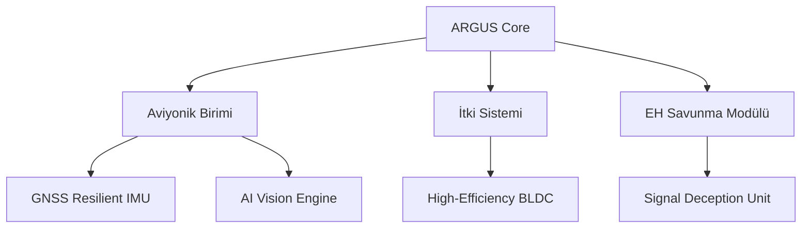

# 🦅 UAV Technical Manual: ARGUS Systems Reference

> **"Göklerin derinliğinde, teknoloji ve ruhun muazzam raksı."**

Bu depo, **ARGUS İnsansız Hava Aracı (İHA)** sistemleri için kapsamlı teknik dökümantasyonu, operasyonel protokolleri ve bakım kılavuzlarını içermektedir. Bu döküman, sadece bir kullanım kılavuzu değil; gökyüzündeki hakimiyetin teknik ve stratejik manifestosudur.

---

## 🛰️ Vizyon ve Stratejik Mimari

ARGUS sistemleri, **LCHI (Low-Cost High-Impact)** felsefesi ile geliştirilmiştir. Minimum maliyetle maksimum operasyonel etkiyi hedefleyen bu yaklaşım, karmaşık elektronik harp ortamlarında dahi yüksek dayanıklılık ve otonomi sunar.

### 📜 Ana Modüller ve Dökümantasyon

| Bölüm | İçerik | Durum |
| :--- | :--- | :--- |
| 🛠️ [Donanım Spesifikasyonları](docs/hardware_specs.md) | Gövde, itki sistemleri ve aviyonik detaylar. | 🟢 Hazır |
| ✈️ [Uçuş Operasyonları](docs/flight_ops.md) | Uçuş öncesi, esnası ve sonrası protokoller. | 🟢 Hazır |
| 🔧 [Bakım ve Lojistik](docs/maintenance.md) | Periyodik bakım tabloları ve saha onarım rehberi. | 🟢 Hazır |
| 📡 [Taktik Elektronik Harp](docs/tactical_ew.md) | Karıştırma önleme ve EH dirençli navigasyon. | 🟡 Güncelleniyor |
| ⚔️ [Alperen Teknoloji Felsefesi](docs/philosophy.md) | Teknolojinin ruhu ve operasyonel disiplin. | 🟢 Hazır |

---

## 🛠️ Sistem Özeti



---

## 📂 Dizin Yapısı

```bash
uav-tech-manual/
├── docs/               # Teknik Dökümantasyon
│   ├── hardware_specs.md
│   ├── flight_ops.md
│   ├── maintenance.md
│   ├── tactical_ew.md
│   └── philosophy.md
├── assets/             # Şemalar ve Teknik Görseller
└── README.md           # Ana Kılavuz Girişi
```

---

## 🚀 Hızlı Başlangıç (Operasyonel Hazırlık)

1.  **Güç Kontrolü**: Batarya voltajlarını (min 14.8V) kontrol edin.
2.  **Sistem Kontrolü**: Aviyonik birimlerin (IMU, Baro) kalibrasyonunu doğrulayın.
3.  **EH Hazırlığı**: OMEGA-tier karıştırma önleme modüllerini aktif edin.
4.  **Veri Linki**: Yer istasyonu (Mission Control) bağlantısını senkronize edin.

---

**Developed with ⚔️ by arch-yunus.**
