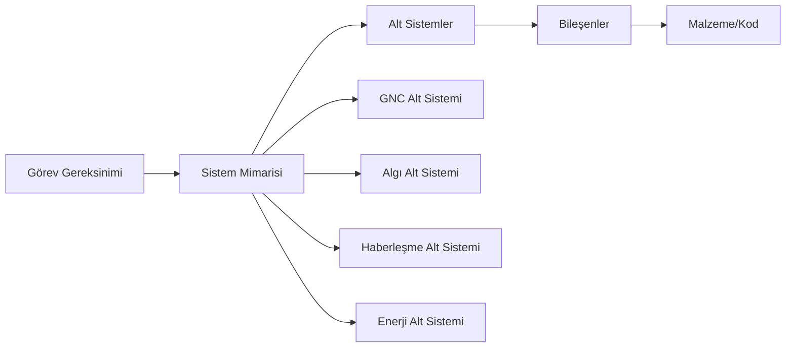

# ⚙️ Modül 6: Sistem Mimarisi Felsefesi ve Mühendislik Vizyonu

> **Amaç:** Teknik bilgi tek başına yetmez. İyi bir İHA mühendisi, tasarım kararlarının arkasındaki felsefeyi anlar, sistemleri bir bütün olarak düşünür ve karmaşıklığı yönetir.

---

## 6.1 LCHI Doktrini: Düşük Maliyet, Yüksek Etki

**LCHI (Low-Cost, High-Impact)**, SUNGUR Akademisi'nin temel mühendislik felsefesidir.

> "Pahalı çözüm bulmak kolaydır. Ucuz çözümü zarifce mühendislemek sanattır."

### Temel Prensipler

| İlke | Açıklama | Örnek |
| :--- | :--- | :--- |
| **Modülerlik** | Her bileşen bağımsız değiştirilebilir. | ESC yanarsa sadece ESC değişir, tüm sistem değil. |
| **Açık Kaynak Önceliği** | Ticari kara kutular yerine şeffaf çözümler. | ArduPilot > Tescilli FC; ROS2 > Ticari Orta Katman |
| **Aşırı Mühendisliğe Karşı** | En basit çalışan çözüm en iyisidir. | 3 satır Python > 300 satır C++ (aynı işi yapıyorsa) |
| **Test Öncelikli Geliştirme** | Birim testler, sahaya çıkmadan önce çalışır. | SITL simülasyon → Bench test → Saha |

---

## 6.2 Siber-Asabiyet: Sistem Kararlılığının Felsefesi

**Asabiyet**, İbn Haldun'un sosyal dayanışma kavramından esinlenir. Teknik bağlamda:

> Karmaşık bir sistemin parçaları arasındaki **güven, tutarlılık ve karşılıklı bağımlılık** ne kadar güçlüyse, sistem dış baskılara o kadar dayanıklıdır.

### Mühendislikte Siber-Asabiyet Uygulaması

```
SİSTEM DAYANIKLILIK PİRAMİDİ
         ▲
        /◆\      → Önce Donanım Güvenilirliği
       /◆◆◆\     → Sonra Yazılım Sağlamlığı (Failsafe)
      /◆◆◆◆◆\    → Ardından Haberleşme Güveni (QoS)
     /◆◆◆◆◆◆◆\   → En temelde Tasarım Felsefesi
```

### Failsafe Katmanları
```
KATMAN 1 (Donanım): Kill switch fiziksel bağlantısı
KATMAN 2 (FC):       Link kaybı → RTH, Batarya kritik → AutoLand
KATMAN 3 (Yazılım):  ROS2 heartbeat → görev iptali
KATMAN 4 (Operatör): Son karar her zaman insanda
```

---

## 6.3 Sistem Düşünme: Bütünü Görmek

İHA bir sistem olarak şu hiyerarşiyle analiz edilir:



**V-Model Geliştirme:** Her sistemin karşısında bir test katmanı vardır. Geliştirme aşamasına başlamadan test kriteri yazılır.

---

## 6.4 Karmaşıklığı Yönetme: KISS ve DRY

- **KISS (Keep It Simple, Stupid):** Her tasarım kararında "Bunu daha basit yapabilir miyim?" diye sor.
- **DRY (Don't Repeat Yourself):** Aynı kodu iki kez yazma. Kütüphane veya fonksiyon yaz.
- **Separation of Concerns:** Guidance, Navigation ve Control ayrı katmanlarda çalışır. Birbirinin işine karışmaz.

---

## 6.5 Açık Kaynak Ekosistemi: Omuzladığın Dev

```
Sen → ROS2 → ArduPilot / PX4 → Linux → GCC → POSIX

Her katmanda binlerce mühendisin yıllar içindeki emeği var.
Onların üzerine inşa et. Sıfırdan yazmak gururdur; 
ama doğru kullanmak zekâdır.
```

---

## 📝 Pratik Alıştırma

1. `uav-systems-architecture` reposundaki `mission_manager.cpp`'yi oku. Kaç tane failsafe katmanı var? Eksik olan var mı?
2. Kendi tasarladığın bir İHA sistemi için LCHI prensiplerine göre bir "Bileşen Seçim Matrisi" oluştur.

---

*← [Elektronik Harp ve Dayanıklı Haberleşme](tactical_ew.md) | [Anasayfaya Dön](../README.md)*
